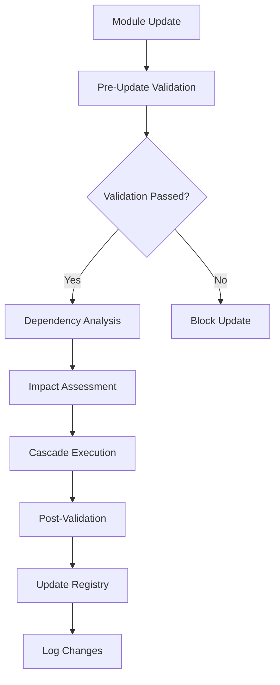

# Super-Claude Hierarchical System

**Revolutionary Modular Framework with Automatic Cascade Updates and Dependency Management**

[](https://github.com/super-claude/hierarchical-system)
[](https://localhost:3737/health)
[](https://localhost:3737/validation)

## 🚀 Overview

Super-Claude is a groundbreaking modular hierarchical system that revolutionizes how AI operates - moving from ad-hoc responses to organized, modular, and consistently improving operations. The system provides automatic cascade updates, comprehensive dependency management, and intelligent validation frameworks.

### Key Features

- **🏗️ Modular Hierarchy**: 6 module types with clear separation of concerns
- **🔄 Automatic Cascade Updates**: Parent changes automatically propagate to children
- **📊 Dependency Graph Management**: Complete relationship mapping with impact analysis
- **✅ Comprehensive Validation**: Multi-layer validation with auto-fix capabilities
- **⚡ High Performance**: Parallel processing and intelligent caching
- **🛡️ Pre-Update Hooks**: Event-driven validation and automation
- **💾 Detailed Logging**: Complete audit trail and monitoring
- **🎯 Semantic Versioning**: Version management with rollback support

## 📋 System Architecture

### Hierarchy Levels

```
L0 (System Core)
├── CLAUDE.md                    # Main configuration
├── cascade-rules.json           # Cascade update rules
├── validation-rules.json        # Validation framework
└── version.json                 # System version info

L1 (Categories)
├── modules/rules/               # Coding standards and conventions
├── modules/templates/           # Reusable code scaffolds
├── modules/agents/              # Specialized sub-agents
├── modules/skills/              # Reusable capabilities
├── modules/commands/            # CLI commands
└── modules/hooks/               # Event-driven automation

L2 (Individual Modules)
├── rule-001 (naming-conventions)
├── rule-002 (code-style)
├── template-001 (component-template)
├── agent-001 (code-reviewer)
├── skill-001 (dependency-analyzer)
├── command-001 (sync-hierarchy)
├── command-002 (validate-system)
└── hook-001 (pre-update-validation)

L3 (Project Files)
└── Your actual code and documentation
```

### Module Types

| Type | Purpose | Cascade Type | Count |
|------|---------|---------------|-------|
| **Rules** | Coding standards and conventions | Automatic | {{RULES_COUNT}} ({{ORIGINAL_RULES}} original + {{CLAUDE_CODE_RULES}} Claude Code) |
| **Templates** | Reusable code scaffolds | Conditional | {{TEMPLATES_COUNT}} |
| **Agents** | Specialized sub-agents | Manual | {{AGENTS_COUNT}} |
| **Skills** | Reusable capabilities | Automatic | {{SKILLS_COUNT}} |
| **Commands** | CLI commands | Automatic | {{COMMANDS_COUNT}} |
| **Hooks** | Event-driven automation | Automatic | {{HOOKS_COUNT}} |

## 🎯 Quick Start

### 1. System Validation
```bash
# Validate system integrity
/validate-system

# Validate with auto-fix
/validate-system --fix

# Detailed validation report
/validate-system --verbose --format=json
```

### 2. Hierarchy Synchronization
```bash
# Sync entire hierarchy
/sync-hierarchy

# Preview changes before applying
/sync-hierarchy --dry-run

# Sync specific module
/sync-hierarchy --module=rule-001
```

### 3. Module Management
```bash
# Show module dependencies
/show-dependencies rule-001

# Update specific module
/update-module naming-conventions --version=1.0.1

# Rollback to previous version
/rollback naming-conventions 1.0.0
```

## 📊 System Status

### Current Health Metrics
- **System Health Score**: {{HEALTH_SCORE}}%
- **Total Modules**: {{TOTAL_MODULES}}
- **Dependencies**: {{TOTAL_DEPENDENCIES}}
- **Validation Pass Rate**: {{VALIDATION_PASS_RATE}}%
- **Graph Health**: {{GRAPH_HEALTH}}%
- **Last Validation**: {{LAST_VALIDATION}}
- **Claude Code Rules Integrated**: {{CLAUDE_CODE_RULES}}

### Module Distribution
```
Core Components:     {{CORE_PERCENTAGE}}%
Configuration:       {{CONFIG_PERCENTAGE}}%
Rules:             {{RULES_PERCENTAGE}}% [{{ORIGINAL_RULES}} original + {{CLAUDE_CODE_RULES}} Claude Code]
Templates:          {{TEMPLATES_PERCENTAGE}}%
Agents:             {{AGENTS_PERCENTAGE}}%
Skills:             {{SKILLS_PERCENTAGE}}%
Commands:           {{COMMANDS_PERCENTAGE}}%
Hooks:              {{HOOKS_PERCENTAGE}}%
```

## 🔄 Cascade Update System

### Cascade Types

1. **Automatic** (Rules, Skills, Commands, Hooks)
   - Changes propagate automatically
   - No user intervention required
   - Fast and efficient

2. **Conditional** (Templates)
   - Changes propagate if compatible
   - Validation required before propagation
   - Ensures template compatibility

3. **Manual** (Agents)
   - Requires explicit confirmation
   - User review before propagation
   - Prevents unintended agent behavior changes

### Cascade Workflow



## 📋 Command Reference

### System Commands

#### `/validate-system`
Validates system integrity and provides health reports.

**Options:**
- `--fix`: Automatically fix detected issues
- `--verbose`: Show detailed output
- `--format=<json|yaml|table|markdown>`: Output format
- `--export-report=<path>`: Save report to file

**Examples:**
```bash
/validate-system
/validate-system --fix --verbose
/validate-system --format=json --export-report=health-report.json
```

#### `/sync-hierarchy`
Triggers cascade updates and hierarchy synchronization.

**Options:**
- `--dry-run`: Preview changes without applying
- `--force`: Force update even if validation fails
- `--module=<id>`: Target specific module
- `--depth=<number>`: Limit cascade depth

**Examples:**
```bash
/sync-hierarchy
/sync-hierarchy --dry-run --verbose
/sync-hierarchy --module=rule-001 --force
```

### Module Management Commands

#### `/show-dependencies <module-id>`
Display dependency tree for a module.

**Examples:**
```bash
/show-dependencies rule-001
/show-dependencies --depth=3 --format=tree
```

#### `/update-module <module-id>`
Update specific module with cascade.

**Options:**
- `--version=<version>`: Target version
- `--force`: Force update despite validation
- `--no-cascade`: Skip cascade updates

**Examples:**
```bash
/update-module rule-001 --version=1.0.1
/update-module template-001 --version=1.1.0 --force
```

#### `/rollback <module-id> <version>`
Rollback module to previous version.

**Examples:**
```bash
/rollback rule-001 1.0.0
/rollback --all 1.0.0
```

## 📊 Monitoring and Analytics

### System Metrics
- **Update Performance**: Track cascade update duration
- **Validation Success Rate**: Monitor validation effectiveness
- **Dependency Health**: Track dependency graph integrity
- **Module Health**: Individual module status monitoring

### Performance Optimization
- **Parallel Processing**: Multi-threaded updates and validation
- **Intelligent Caching**: Cache validation results and dependency analysis
- **Incremental Updates**: Only process affected modules
- **Resource Management**: Optimize memory and CPU usage

## 🛡️ Security and Validation

### Validation Layers
1. **System Integrity**: Core files and configuration validation
2. **Module Validation**: Individual module metadata and content validation
3. **Dependency Analysis**: Circular dependency detection and version conflicts
4. **Performance Validation**: System performance and resource usage
5. **Security Validation**: File permissions and vulnerability scanning

### Auto-Fix Capabilities
- **Missing Frontmatter**: Automatically add required metadata
- **Invalid ID Format**: Fix module ID formatting
- **Missing Dependencies**: Add missing dependency references
- **Version Conflicts**: Resolve version compatibility issues
- **File Permissions**: Fix permission and access issues

## 🔧 Configuration

### Core Configuration Files

#### `CLAUDE.md`
Main system configuration and documentation.

#### `cascade-rules.json`
Defines cascade update behavior and rules.

#### `validation-rules.json`
Configures validation framework and thresholds.

#### `dependency-graph.json`
Stores complete dependency relationship mapping.

### Customization

You can customize the system by:
1. **Adding New Modules**: Create additional rules, templates, agents, etc.
2. **Modifying Rules**: Update existing rule configurations
3. **Extending Commands**: Add new CLI commands
4. **Custom Hooks**: Create custom event handlers
5. **Configuration Changes**: Modify cascade and validation rules

## 📚 Module Development

### Creating New Modules

1. **Choose Module Type**: Rule, Template, Agent, Skill, Command, or Hook
2. **Create Module File**: Follow the established template structure
3. **Add Frontmatter**: Include required metadata fields
4. **Define Dependencies**: Specify parent-child relationships
5. **Implement Functionality**: Add module-specific content
6. **Test Integration**: Validate module works with system

### Module Metadata Template
```yaml
---
id: module-001
type: rule|template|agent|skill|command|hook
version: 1.0.0
description: Brief module description
parents: [CLAUDE.md]
children: []
auto_cascade: true|false|conditional|manual
last_updated: {{CURRENT_DATE}}
---
```

## 🤝 Integration

### External Integrations
- **Git**: Version control integration for change tracking
- **CI/CD**: Pipeline integration for automated validation
- **Monitoring Systems**: Integration with external monitoring tools
- **File System Watchers**: Automatic change detection and processing

### API Access
The system provides REST APIs for:
- System status and health monitoring
- Module management and updates
- Dependency graph queries
- Validation results and reports

## 🚨 Troubleshooting

### Common Issues

#### Validation Failures
```bash
# Run detailed validation
/validate-system --verbose --fix

# Check specific module
/show-dependencies <module-id>
```

#### Cascade Update Issues
```bash
# Preview cascade changes
/sync-hierarchy --dry-run

# Force update if necessary
/sync-hierarchy --force
```

#### Dependency Conflicts
```bash
# Analyze dependency graph
/validate-system --performance-check

# Check specific dependencies
/show-dependencies --depth=5
```

### Recovery Procedures
1. **System Restore**: Use rollback functionality
2. **Backup Recovery**: Restore from system backups
3. **Partial Recovery**: Restore specific modules
4. **Configuration Reset**: Reset to default configuration

## 📈 Performance Metrics

### Current System Performance
- **Validation Duration**: {{VALIDATION_DURATION}} seconds ({{VALIDATION_STATUS}})
- **Cascade Performance**: {{CASCADE_PERFORMANCE}} seconds ({{CASCADE_STATUS}})
- **Memory Usage**: {{MEMORY_USAGE}}MB ({{MEMORY_STATUS}})
- **Graph Processing**: {{GRAPH_NODES}} nodes, {{GRAPH_EDGES}} edges ({{GRAPH_STATUS}})
- **Rules Engine**: {{ACTIVE_RULES}} active rules ({{RULES_PERCENTAGE}}% of system)

### Optimization Features
- **Parallel Validation**: Process multiple modules simultaneously
- **Smart Caching**: Cache results for unchanged modules
- **Incremental Updates**: Only process affected modules
- **Resource Optimization**: Intelligent resource management

## 🗺️ Roadmap

### Upcoming Features (v1.1.0)
- **GUI Interface**: Web-based system management dashboard
- **Advanced Analytics**: Enhanced monitoring and reporting
- **Multi-System Support**: Manage multiple Super-Claude instances
- **Plugin System**: Extensible plugin architecture
- **Performance Profiling**: Advanced performance analysis tools

### Future Enhancements
- **AI-Powered Optimization**: Machine learning for system optimization
- **Distributed Processing**: Multi-node cluster support
- **Real-time Collaboration**: Multi-user system management
- **Advanced Security**: Enhanced security features and audit trails

## 📄 License

This project is licensed under the MIT License - see the LICENSE file for details.

## 🤝 Contributing

We welcome contributions! Please see our [Contributing Guidelines](CONTRIBUTING.md) for details.

## 📞 Support

For support and questions:
- **Documentation**: Check this README and module documentation
- **Issues**: Report issues via the issue tracker
- **Community**: Join our community discussions
- **Email**: Contact support@super-claude.ai

---

**Super-Claude: The future of AI assistance is modular, cascading, and beautifully organized!**

*Built with ❤️ for the AI development community*

---

*This README is automatically generated from the current system state. Last updated: {{GENERATION_TIMESTAMP}}*